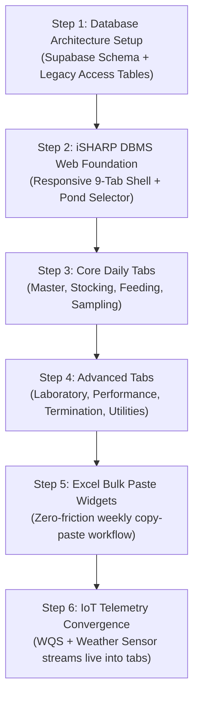

# iSHARP Database Management System (DBMS)
## Web UI Specification & Legacy `GrowoutPondMaster` Recreation Blueprint

**Project:** iSHARP Modern Web Platform & Cloud Database Migration  
**Target System:** `iSHARP Database Management System` (Web Dashboard on Supabase)  
**Reference Legacy Form:** Microsoft Access `Forms!GrowoutPondMaster` (`Bab SGo (r41) 26.09.18.accdb`)  
**Design Principle:** **100% Mental Continuity for Farm Staff + Subtle Modern Enhancements**  
**Author:** Syafiq & Engineering Team  
**Date:** September 2026  
**Status:** Architecture & UI Specification Finalized (Planning Phase — No Code Modified)  

---

## 1. Vision & Strategy: Why Copying `GrowoutPondMaster` is the Right Move

The farm staff (operators, field supervisors, lab technicians, and managers) have used the `GrowoutPondMaster` interface for over a decade. They know:
- Exactly which tab to click for weekly sampling (`sampling`).
- Where to record incoming PL hatchery batches (`stocking`).
- Where to track disease status and PCR results (`laboratory`).
- Where to verify daily harvests and sales grading (`termination`).
- Where to check paddlewheel HP and pond preparation dates (`master`).

By faithfully replicating the 9-tab structure and workflow of `GrowoutPondMaster` inside our modern web platform (**iSHARP DBMS**), **staff will experience zero confusion or friction**. At the same time, moving to Supabase eliminates Microsoft Access file locking, corrupt `.accdb` crashes, and single-computer bottlenecks.

---

## 2. Anatomy of Legacy `GrowoutPondMaster`

Our deep-dive inspection of the Access form definition revealed the exact structure:

```
┌──────────────────────────────────────────────────────────────────────────────────────────────────┐
│  🏢 iSHARP sdn. bhd. — POND MASTER CONTROL HEADER                                                │
│  [ Pond Selector: 2010112.43 ▾ ] [ Pond: 01.01.12 ] [ Module: 01 ] [ Area: 0.50 ha ]              │
│  Status: 🟢 PRODUCTION | Active: ACTiVE | Cycle: 43 | Crop: 39 | Species: P. VANNAMEi             │
├──────────────────────────────────────────────────────────────────────────────────────────────────┤
│  [ 1. Master ] [ 2. Laboratory ] [ 3. Stocking ] [ 4. Feeding ] [ 5. Sampling ]                  │
│  [ 6. Performance ] [ 7. Termination ] [ 8. Staff+Remarks ] [ 9. Utilities ]                     │
├──────────────────────────────────────────────────────────────────────────────────────────────────┤
│                                                                                                  │
│   ACTIVE TAB CONTENT AREA (Recreates Subforms & Bulk Actions)                                    │
│   • Tab 1: Pond Prep Milestones (Cleaning, Repair, Filling, Culture, QA/QC, Ready) & PWA HP     │
│   • Tab 2: Disease Pathology (EHP, EMS, WSSV) + PCR Lab Results + [ Bulk PL Test Paste ]         │
│   • Tab 3: Stocking Batches + Nursery Runs + Transfers + [ Bulk Stocking Paste ]                 │
│   • Tab 4: Daily Feed Records + SAP Movement Ledger (261/262) + [ Bulk Feed Paste ]             │
│   • Tab 5: Weekly Growth Sampling (ABW, AWG, SR%, Biomass) + [ Bulk Sampling Paste ]             │
│   • Tab 6: Interactive Growth Curves & Strategy vs Actual Performance Charts                     │
│   • Tab 7: Harvest Plans + Daily Harvests + Sales Grading Packout + [ Bulk Harvest Paste ]      │
│   • Tab 8: Assigned Pond Staff + Daily Operator Log Notes                                        │
│   • Tab 9: Actions Engine (+ Activate New Cycle, P&L Costing, Forecasts, Reports)               │
│                                                                                                  │
└──────────────────────────────────────────────────────────────────────────────────────────────────┘
```

---

## 3. Detailed Specification: The 9 Core Tabs

### Header Section: Master Pond Identification & Context
Always visible across all tabs so the user never loses context:
- **Pond Selector Dropdown:** Instant searchable dropdown (`2010112.43` or physical `01.01.12`).
- **Physical Coordinates:** Farm (`SETiU`), Module (`01`), Row (`01`), Pond (`12`), Area (`0.50 ha`), Type (`FULL LINING`), Usage (`GROWOUT`).
- **Pond Badges:**
  - `Pond Status`: `PRODUCTION` (Green), `iDLE` (Blue), `MAINTENANCE` (Orange), `CLOSE` (Gray).
  - `Pond Active`: `ACTiVE` / `iN ACTiVE`.
  - `Cycle No`: e.g. `43` | `Crop No`: e.g. `39`.
  - `Disease Flag`: `NO ISSUES` (Green), `EHP/EMS/WSSV` (Red/Yellow alert).

---

### Tab 1: `[ Master ]` (Pond Lifecycle & Asset Setup)
*Legacy Access Control: `Page57`*

| Section | Legacy Access Fields | Web DBMS Recreation |
| :--- | :--- | :--- |
| **Pond Assets & Aeration** | `area`, `pond type`, `pond usage`, `I HP`, `2 HP` | Displays pond dimensions and total paddlewheel aerator count (1HP, 2HP, and auto-computed Total HP). |
| **Preparation Milestones** | `date cycle`, `date cleaning`, `DateRepair`, `date Filling`, `date culture`, `DateBabyBox`, `DateQaqc`, `date ready`, `DatePlanStock` | Visual timeline / milestone date inputs tracking physical pond preparation from drain-out to water culture QA/QC sign-off. |
| **Idle Tracking** | `idledays`, `IdleStatus` | Automatic calculation of days pond remained dry/idle between cycles. |
| **Cycle Snapshots (Subforms)**| `GrowoutViewStocking`, `GrowoutViewHarvest`, `GrowoutViewSampling`, `GrowoutViewDoc`, `GrowoutViewIdle` | 5 compact summary cards displaying DOC, stocked fry, latest ABW, total harvest kg, and idle history. |

---

### Tab 2: `[ Laboratory ]` (Biosecurity & Lab Pathology)
*Legacy Access Control: `Page481`*

| Feature | Legacy Access Equivalent | Web DBMS Recreation |
| :--- | :--- | :--- |
| **Disease Log Grid** | Subform `GrowoutPondIssues` | Interactive table showing: `issuedate`, `issueCat` (DISEASE), `issuestts` (EHP, EMS, WSSV), `issuetest` (MICROSCOPY, PCR), `issueflag` (GREEN/YELLOW/RED), `issueGrade` (G0, G1, G2), `issueNote` (NEGATIVE/POSITIVE). |
| **PL Stress & Hatchery Lab QC** | Table `GrowoutLaboratoryPL` | Lab test results: Formalin stress survival %, 0 ppt salinity stress, Vibrio agar plating (Yellow/Green colonies, TVC, VA, VV, VP counts), PCR toxin/plasmid results. |
| **Bulk Data Entry Action** | Button `Command496` ("Insert bulk pl test data") | `[ 📋 Paste Excel Lab Data ]` button: opens a paste modal to copy-paste weekly lab tables directly from Excel. |

---

### Tab 3: `[ Stocking ]` (Batch & Nursery Records)
*Legacy Access Control: `Page303`*

| Feature | Legacy Access Equivalent | Web DBMS Recreation |
| :--- | :--- | :--- |
| **Pond Stocking Records** | Subform `GrowoutPondStocking` | Grid of stocking events: `stckdate`, `stcksource` (Hatchery e.g. SHT), `stckspcs` (P. VANNAMEI / MONODON), `stckpcs` (netto), `stckallow` (allowance), `stcktotal` (gross), `density`, `stcktype` (SPT), `BSLine` (Broodstock: Syaqua/Dragon), `stcktank`, `stcksize` (PL size). |
| **Nursery & Transfers** | Subforms `GrowoutNurseryStocking`, `GrowoutPondTransfer` | Pre-growout nursery stage details and inter-pond transfer tracking. |
| **Bulk Data Entry Action** | Button `Command352` ("Insert bulk pond stocking data") | `[ 📋 Paste Excel Stocking Data ]` modal to paste stocking batches directly from hatchery delivery manifests. |

---

### Tab 4: `[ Feeding ]` (Daily Feeds & SAP ERP Ledger)
*Legacy Access Control: `Page324`*

| Feature | Legacy Access Equivalent | Web DBMS Recreation |
| :--- | :--- | :--- |
| **Daily Farm Feeding** | Subform `GrowoutPondFeed` | Daily feed logbook: `date`, `feed` (brand/code), `quantity` (kg). |
| **SAP ERP Goods Movements** | Subforms `GrowoutViewFeedSap`, `GrowoutViewFeedCom` | Direct ledger of SAP goods issues: `Orderno`, `SapPostDate`, `SapFeedName` (CP 5001, CP 5002), `SapFeedKgs`, `SapMovement` (261 issue, 262 reversal). |
| **Nursery Feeding** | Subform `GrowoutNurseryFeed` | Feed consumption during nursery phase. |
| **Bulk Entry & SAP Sync** | Buttons `Command353`, `Command525`, `Command526`, `Command527` | Direct Excel feed paste button + SAP batch file upload widget. |

---

### Tab 5: `[ Sampling ]` (Weekly Biometrics & Growth)
*Legacy Access Control: `Page31`*

| Feature | Legacy Access Equivalent | Web DBMS Recreation |
| :--- | :--- | :--- |
| **Weekly Sampling Grid** | Subform `GrowoutPondSampling` | Complete biometric history: `smpldate`, `SmplDoc` (DOC), `smplabw` (ABW grams), `smplsurv` (Survival %), `smplbms` (Estimated Biomass kg), `SmplDFed` (Daily feed kg), `SmplTFed` (Accumulated feed kg), `AWG` (Weekly gain), `ADG` (Daily gain). |
| **Strategy Comparison** | Fields `sttgabw`, `sttgsurv`, `sttgbms`, `sttgTFed` | Compares actual pond growth against the standard target strategy growth curve. |
| **IoT Sensor Integration** | *Brand new modern enhancement!* | Alongside human sampling records, displays 7-day WQS sensor trends (DO, pH, Temp, Salinity) for that exact culture week! |
| **Bulk Sampling Paste** | Button `Command351` ("Insert bulk pond sampling data") | `[ 📋 Paste Excel Sampling Data ]` button: copy-paste weekly net cast sample sheets directly. |

---

### Tab 6: `[ Performance ]` (Growth & Efficiency Visuals)
*Legacy Access Control: `Page533`*

| Feature | Legacy Access Equivalent | Web DBMS Recreation |
| :--- | :--- | :--- |
| **Growth Curve Chart** | `OLEUnbound0` (Legacy MS Graph) | Interactive modern Chart.js / SVG growth curve comparing: Actual ABW vs Strategy ABW vs Historical Farm Benchmark. |
| **Biomass & FCR Trajectory**| Query calculations | Dynamic visual cards showing: Current Biomass (kg), Cumulative FCR, Average Daily Gain (ADG), and Projected Harvest DOC. |

---

### Tab 7: `[ Termination ]` (Harvest & Commercial Sales Grading)
*Legacy Access Control: `Page330`*

| Feature | Legacy Access Equivalent | Web DBMS Recreation |
| :--- | :--- | :--- |
| **Harvest Planning** | Subform `GrowoutPondHarvestPlan` | Target harvest date, estimated ABW, planned biomass, and target market window. |
| **Daily Harvest Events** | Subform `GrowoutPondHarvestDaily` | Harvest log: `harvdate`, `harvstts` (PARTIAL vs TERMINATION), `harvwgt` (kg), `harvabw` (g), `harvRev` (gross RM), `harvmtd` (Manual net / machine). |
| **Commercial Packout Grading** | Table `GrowoutPondHarvestSales` | Commercial sales packout by seafood buyer (e.g. SBH Marine Industries): Good Grades (1–4), 2nd Grade, Small sizes (1–4), Below size, Rubbish deduction, Net Weight, and Sales Total. |
| **Financial Costing Link** | Subform `GrowoutViewFinance` | Instant financial P&L summary: Total Revenue, Total Cost, EBITDA, and Cost per kg. |
| **Bulk Harvest Entry** | Button `Command495` ("Insert bulk pond harvest and sales") | `[ 📋 Paste Excel Harvest Data ]` button. |

---

### Tab 8: `[ Staff + Remarks ]` (Operations Logbook)
*Legacy Access Control: `Page381`*

| Feature | Legacy Access Equivalent | Web DBMS Recreation |
| :--- | :--- | :--- |
| **Assigned Personnel** | Subform `GrowoutPondStaff` | Staff allocated to this pond: Pond Manager, Supervisor, Shift Leader, and Field Operators. |
| **Operational Logbook** | Subform `GrowoutPondNote` | Date-stamped field observations, feeding anomalies, chemical/probiotic dosing notes, and weather impact logs. |

---

### Tab 9: `[ Utilities / Actions ]` (Control Engine)
*Legacy Access Control: `Page454`*

| Action Button | Legacy Access Control | Web DBMS Recreation |
| :--- | :--- | :--- |
| **Activate New Cycle** | Button `Command169` (`InsertNew_DblClick`) | One-click `[ ➕ Start New Culture Cycle ]` button: runs the automated PostgreSQL function to close the current cycle and increment `PondIndex` (e.g. `2010212.40` $\rightarrow$ `2010212.41`). |
| **Generate Final Table** | Button `viewpdtn` | Exports complete pond cycle summary to Excel / PDF report. |
| **Incentive Calculation** | Button `Command344` | Supervisor & operator crop bonus / harvest incentive calculation. |
| **Cycle Tracking & History** | Button `Command511` | Timeline of all historical cycles for this physical pond (`.01` to current). |
| **Sampling & Harvest Forecast**| Button `Command530` | Predictive AI / curve forecast of expected harvest date based on current ADG. |

---

## 4. Modern Improvements Over Microsoft Access

While preserving the 100% familiar layout, the web implementation delivers these critical upgrades:

1. **Native Excel Copy-Paste Widget on Every Tab:**
   - Instead of opening fragile raw Access table datasheets, staff click `[ 📋 Paste from Excel ]` on any tab (Sampling, Feed, Harvest, Stocking).
   - They paste their Excel columns (Ctrl+V); the web app validates each row with instant green/red badges before committing to Supabase.
2. **True Multi-User Cloud Operations:**
   - 20 people can work simultaneously: Lab technicians enter PCR tests on the `Laboratory` tab, supervisors enter weekly ABWs on `Sampling`, and office staff reconcile invoices on `Termination` without file-locking crashes.
3. **Integrated IoT Telemetry (WQS & Weather):**
   - Telemetry from our Water Quality Stations (DO, pH, Salinity, Temp) and Weather Station is automatically linked to the active pond cycle without any manual data entry.
4. **Mobile & Tablet Responsive Layout:**
   - Operators on the jetty can open `iSHARP DBMS` on their smartphones or waterproof tablets to view data or log notes right at the pond edge.
5. **Rock-Solid Data Safety:**
   - Hosted securely in Supabase PostgreSQL with automated daily cloud backups, point-in-time recovery, and role-based permissions (operators vs supervisors vs management).

---

## 5. Implementation Roadmap for iSHARP DBMS



This specification will serve as our exact master reference when we proceed with building the web app. No code has been touched or modified in this phase.
