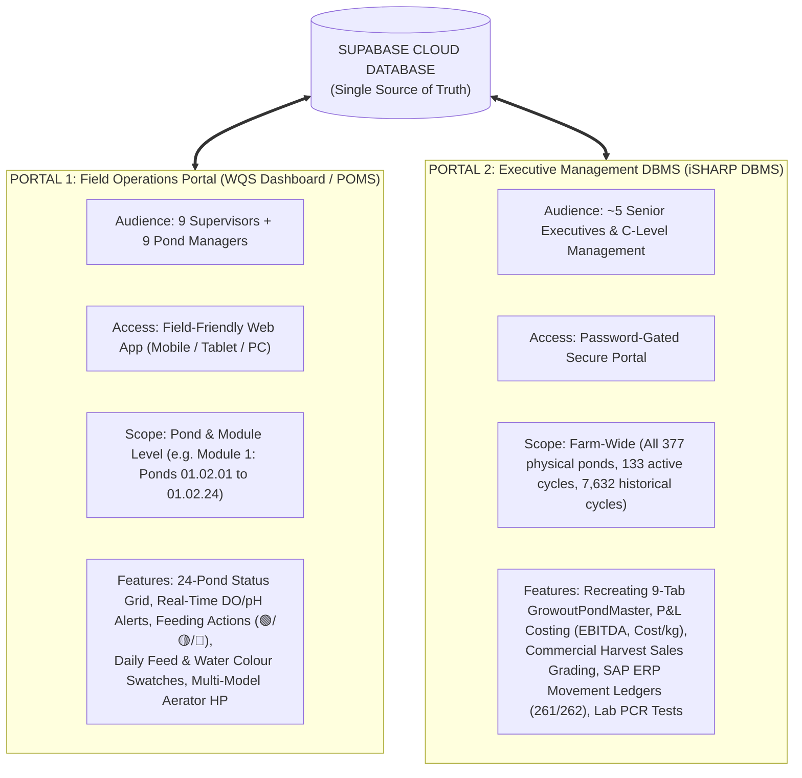
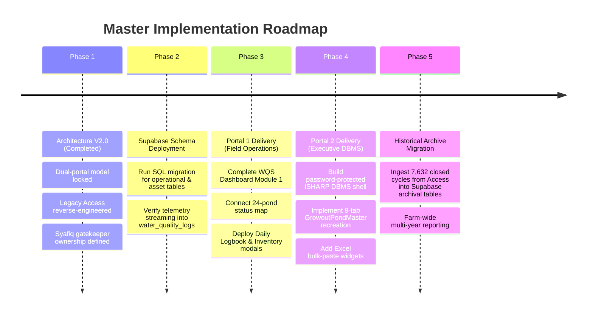

# iSHARP Enterprise Aquaculture Platform
## Grand Unified System Architecture Plan (V2.0)

**Project:** iSHARP Precision Aquaculture Operations & Cloud Management Platform  
**Farm Location:** Blue Archipelago Berhad (BAB) — Setiu Farm (`SETiU`), Terengganu  
**Core Database Principle:** `pond_index` (e.g. `2010112.43`) is the Primary Foreign Key across all tables  
**Backend:** Unified Supabase PostgreSQL Cloud Database (`keappoukeagyzpoxkrru.supabase.co`)  
**Frontend Deployment:** Netlify Single Application with Role-Based Portals  
**Author / Lead:** Syafiq & Engineering Team  
**Date:** September 2026  
**Status:** Unified Enterprise Architecture Finalized & Active  

---

## 1. Executive Summary: The Evolution to V2.0

Version 1.0 of this architecture was conceived as a localized telemetry prototype for Module 1 (24 ponds). Following our comprehensive reverse-engineering of the farm's 180 MB Microsoft Access database (`Bab SGo (r41) 26.09.18.accdb`), the architecture has expanded to its true enterprise scope.

The platform unites:
1. **Physical IoT Sensor Telemetry** (WQS DO, pH, Temp, Salinity, Weather Station, Feed Barrel Sonar).
2. **Field Operations Logbook** (Supervisors and Managers entering daily feed, tray % remnant, water colour swatches, mortality, aeration HP).
3. **Executive Enterprise Management** (C-Level management reviewing the 9-tab `GrowoutPondMaster` interface, P&L financial costing, commercial buyer sales grading, and SAP ERP feed reconciliations).

---

## 2. Dual-Portal Ecosystem (Role-Based Frontends)

Instead of forcing all 23 farm staff into one complex screen, the system provides **two purpose-built portals** powered by the **exact same Supabase cloud database**:



### Key Differences Between Portals:

| Attribute | Portal 1: Field Operations (WQS Dashboard) | Portal 2: Executive Management (iSHARP DBMS) |
| :--- | :--- | :--- |
| **Primary Users** | 9 Field Supervisors, 9 Pond Managers | ~5 Senior Executives, Farm Director |
| **Security / Gating** | Open field access with quick **Pond PIN** for edits | **Password Protected** (Restricted Access) |
| **Visual Design** | Visual cards, color badges, big buttons for wet thumbs | Dense data tables, 9-tab navigation, financial summaries |
| **Device Focus** | Smartphones, tablets on jetty, supervisor laptops | Office desktop monitors, executive tablets |
| **Data Scope** | Current culture cycle, 7-day sensor telemetry, daily logs | 12+ years of historical data, commercial packout, P&L |

---

## 3. The Unified Supabase Database Architecture

The database is partitioned into four clear functional tiers:

```
┌──────────────────────────────────────────────────────────────────────────────────────────────────┐
│                                   SUPABASE CLOUD POSTGRESQL                                      │
├────────────────────────────────┬────────────────────────────────┬───────────────────────────────┤
│ 1. IoT TELEMETRY (Permanently  │ 2. OPERATIONAL BRIDGE          │ 3. EXECUTIVE ENTERPRISE       │
│    Anchored Station Facts)     │    (Shared by Both Portals)    │    (Restricted Access)        │
│                                │                                │                               │
│ • water_quality_logs           │ • active_operational_ponds     │ • pond_cycle_pnl              │
│   (DO, pH, Temp, Salinity,     │   (Syafiq's Manual Gatekeeper) │   (EBITDA, Cost/kg, Revenue)  │
│    ORP streaming records)      │ • stocking_records             │ • harvest_sales_grading       │
│ • weather_logs                 │   (Master cycle dimension)     │   (Buyer packout: Good/Small) │
│   (Rainfall, Air Temp, Solar)  │ • biometrics_sampling          │ • sap_feed_ledger             │
│ • feed_barrel_logs             │   (Weekly ABW, AWG, SR%, Bms)  │   (SAP movements 261/262)     │
│   (Sonar feed hopper level)    │ • daily_pond_records           │ • hatchery_qc_tests           │
│                                │   (Daily feed, swatches, tray) │   (PCR EMS/EHP/WSSV, Vibrio)  │
│                                │ • pond_aerator_inventory       │                               │
│                                │   (1HP, 2HP multi-model units) │                               │
└────────────────────────────────┴────────────────────────────────┴───────────────────────────────┘
```

### 🔑 Cardinal Architectural Rules:
1. **`pond_index` is King:** Every operational, biometrics, financial, and inventory table references `stocking_records(pond_index)`. This ensures seamless continuity and prevents orphaned records after harvest.
2. **Physically Anchored WQS Stations:** WQS hardware stations stay physically installed at specific ponds (e.g. Station 12 $\rightarrow$ Pond `01.02.12`). Sensor firmware sends physical `Pond` (e.g. `01.02.12`), which Supabase resolves via `active_operational_ponds`.
3. **Syafiq's Dedicated Gatekeeper Ownership:** The table `active_operational_ponds` is **manually maintained by Syafiq** without uncontrolled automated scripts. Syafiq controls exactly which physical ponds are actively receiving IoT telemetry.
4. **Single Source of Status Colors:** The 24-pond card status color (🟢 Normal / 🟡 Watch / 🔴 Alert) is generated dynamically from the WQS `FeedingActionRenderer` decision engine in `script.js`.

---

## 4. Portal 1: Field Operations Portal Specification

### View 1: Supervisor Module Map (Module 1 — 24 Ponds)
- **Scope:** 24 ponds under 1 supervisor (`01.02.01` to `01.02.24`).
- **Visuals:** Responsive 4×6 or 3×8 grid of pond cards.
- **Card Information:**
  - Pond Number (e.g. `Pond 12`).
  - Species Badge: `VAN` (Vannamei) or `MON` (Monodon).
  - Culture Age: `DOC 48`.
  - Status Color: 🟢 Green (Feeding Normal), 🟡 Yellow (Watch/Reduce), 🔴 Red (Critical/Stop Feed).
  - Clicking any card opens that pond's telemetry and drill-down dashboard.

### View 2: Pond Telemetry & Drill-Down Dashboard
- Displays real-time WQS sensor readings (DO, pH, Temp, Salinity, ORP).
- Displays latest biometric sampling results (ABW, AWG, SR%, Estimated Biomass).
- Action Buttons (Protected by quick Pond Number PIN, e.g. "12" for Pond 12):
  - `[ 📋 Pond Field Inventory ]`
  - `[ ✍️ Daily Pond Record ]`

### View 3: Pond Field Inventory (Multi-Model Aeration & Assets)
- **Aerator Horsepower Breakdown:**
  - Multi-model entry: records 1.0 HP, 2.0 HP, and 4.0 HP units per pond.
  - Automatically computes total running aeration capacity:  
    $$\text{Total Active HP} = (N_{1\text{HP}} \times 1.0) + (N_{2\text{HP}} \times 2.0) + (N_{4\text{HP}} \times 4.0)$$
- **Other Equipment:** Feeding trays count, autofeeders count, jetty condition flag.

### View 4: Daily Pond Record (Visual Journal UI)
- **Interactive Date Ribbon:** Horizontal strip with today pre-selected and past days navigable with one tap.
- **Feed & Tray % Meter:** Total daily feed (kg) + feed tray remnant % selector.
- **Visual Water Colour Swatch Selector (Tappable Realistic Color Tiles):**
  - 🟢 **Healthy Green (Chlorella):** `#68A225`
  - 🟡 **Golden Brown (Diatom - Ideal):** `#A3833D`
  - 🟤 **Dark Brown (Organic load):** `#6D4E25`
  - 🔵 **Clear / Pale (Algae crash warning):** `#88B2C4`
  - ⚪ **Milky / Turbid (Suspended solids):** `#C2C7B8`
  - ⚫ **Dark / Blackish (Bottom sediment):** `#3B3E35`
- **Health Section:** Mortality count (highlighted in red if > 0).

---

## 5. Portal 2: Executive Management Portal (iSHARP DBMS)

Faithfully recreates the 9-tab interface of Microsoft Access `Forms!GrowoutPondMaster` for senior leadership:

```
┌──────────────────────────────────────────────────────────────────────────────────────────────────┐
│  🏢 iSHARP Database Management System — POND MASTER CONTROL HEADER                               │
│  [ Pond Selector: 2010112.43 ▾ ] [ Pond: 01.01.12 ] [ Module: 01 ] [ Area: 0.50 ha ]              │
│  Status: 🟢 PRODUCTION | Active: ACTiVE | Cycle: 43 | Crop: 39 | Species: P. VANNAMEi             │
├──────────────────────────────────────────────────────────────────────────────────────────────────┤
│  [ 1. Master ] [ 2. Laboratory ] [ 3. Stocking ] [ 4. Feeding ] [ 5. Sampling ]                  │
│  [ 6. Performance ] [ 7. Termination ] [ 8. Staff+Remarks ] [ 9. Utilities ]                     │
└──────────────────────────────────────────────────────────────────────────────────────────────────┘
```

1. **`[ 1. Master ]`:** Pond preparation milestones (`date cleaning`, `DateRepair`, `date Filling`, `date culture`, `DateBabyBox`, `DateQaqc`, `date ready`), PWA HP, idle days, and 5 cycle snapshot cards.
2. **`[ 2. Laboratory ]`:** Disease pathology log (`GrowoutPondIssues`: EHP, EMS, WSSV) + PCR lab tests + `[ 📋 Paste Excel Lab Data ]` button.
3. **`[ 3. Stocking ]`:** Stocking batches (`GrowoutPondStocking`: Hatchery, PL qty, density, Broodstock line) + Nursery & Transfers + `[ 📋 Paste Excel Stocking Data ]` button.
4. **`[ 4. Feeding ]`:** Daily feed ledger + SAP ERP goods movements (261/262) + `[ 📋 Paste Excel Feed Data ]` button.
5. **`[ 5. Sampling ]`:** Weekly growth sampling (ABW, AWG, SR%, Biomass) vs Strategy Curves + **Live WQS Sensor Convergence** + `[ 📋 Paste Excel Sampling Data ]` button.
6. **`[ 6. Performance ]`:** Interactive growth curves (Actual ABW vs Strategy Curve vs Historical Benchmark).
7. **`[ 7. Termination ]`:** Harvest planning + Daily harvests + Commercial buyer sales packout grading (Good 1-4, Small, Below) + `[ 📋 Paste Excel Harvest Data ]` button.
8. **`[ 8. Staff+Remarks ]`:** Assigned personnel + Date-stamped field observation logbook.
9. **`[ 9. Utilities ]`:** Cycle engine (+ Start New Cycle rollover), P&L costing summaries, multi-year reports.

---

## 6. Access Control & Deployment Strategy

Both portals are deployed under a single Netlify domain with clean routing and security:

```
Netlify Site: https://your-site.netlify.app/
│
├── / (Home)                         ──► Portal 1: Supervisor Module Map (Field Operations)
├── /pond.html?id=01.02.12           ──► Portal 1: Pond Telemetry & Drill-Down Modals
│
└── /admin/ (or /dbms/)              ──► Portal 2: Executive Management Portal (iSHARP DBMS)
                                         🔒 Protected by Password Gate
```

### Password Protection for Executive DBMS:
- The `/admin/` or `/dbms/` route is protected via **Netlify Access Control / Password Gate** (or Supabase Auth).
- Only the ~5 senior executives have the credentials to access farm financials, sales prices, and master cycle editing.
- Field supervisors and managers access `/` directly on their phones without passwords to log operational data quickly.

---

## 7. Phased Implementation Roadmap



---

## 8. Summary of Alignment

- **Syafiq's Manual Control:** Syafiq maintains total ownership of `active_operational_ponds`.
- **WQS Sensors Anchored:** Hardware units correspond directly to physical ponds.
- **Password Protected DBMS:** Full separation between field operations and senior executive commercial data.
- **Unified Foundation:** Zero duplicate databases. One cloud Supabase instance powering the future of the farm.
